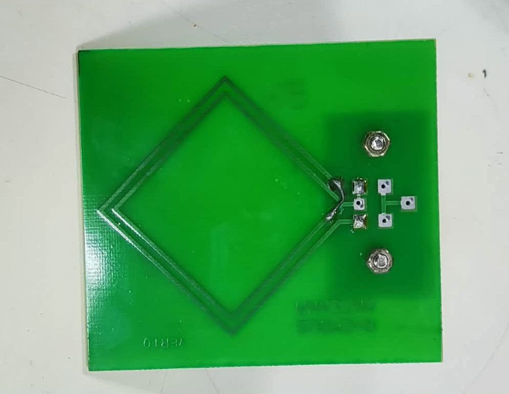
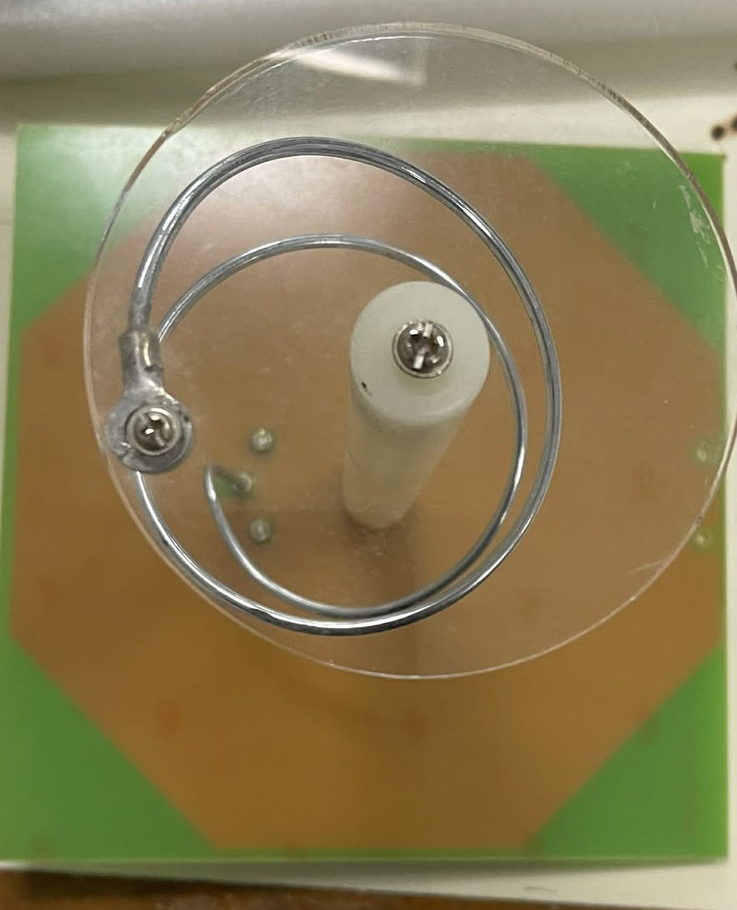

# Experiment 21: Antenna Trainer Kit

## Objective

- To analyze the radiation patterns, gain, and directivity of various resonant and non-resonant antennas.
- To understand the role of parasitic elements and phased arrays in shaping electromagnetic fields.
- To demonstrate the necessity of impedance matching in RF transmission using a matching stub.

---

## Materials & Components

### Equipment

- **Antenna Trainer** – The main control unit containing the RF signal generator, modulation controls, and measurement displays for signal strength.

- **Transmitting Mast** – A vertical support structure that holds the test antenna and allows for 360° rotation to plot radiation patterns.
- **Receiving Mast** – A stationary support used to hold the detector or receiving antenna at a fixed distance from the transmitter.
- **RF Detector** – A device that rectifies the received RF signal into a DC voltage or current, allowing the signal strength to be read on a meter.

- **Matching Stub** – A tunable transmission line component used to match the antenna’s complex impedance to the transmitter's 50Ω or 75Ω output, minimizing reflections.

### Antenna Elements

1. **Simple Dipole λ/2** – A center-fed resonant antenna with a total length of half a wavelength; it produces a classic omnidirectional “figure-8” pattern.

2. **Simple Dipole λ/4** – A shortened antenna element often used as a monopole over a ground plane to save physical space.

3. **Simple Dipole 3λ/2** – A long-wire antenna operating at a higher harmonic, resulting in a more complex radiation pattern with multiple lobes.

4. **Folded Dipole λ/2** – A dipole where the ends are connected by a second conductor; it increases input impedance to roughly 300Ω and provides wider bandwidth.

5. **Yagi-UDA Folded Dipole (3E)** – A directional antenna using one folded dipole as the driven element, one reflector, and one director to focus the beam.

6. **Yagi-UDA Folded Dipole (5E)** – An array with five elements (1 driver, 1 reflector, 3 directors) designed for higher forward gain and a narrower beamwidth.

7. **Yagi-UDA Simple Dipole (5E)** – Similar to the 5E folded version but uses a standard simple dipole as the driven element, usually resulting in narrower bandwidth.

8. **Yagi-UDA Simple Dipole (7E)** – A high-gain directional array with seven elements, providing maximum directivity and the smallest half-power beamwidth in the set.

9. **Hertz Antenna** – A generic term for any balanced antenna that is not connected to the earth/ground, typically a half-wave dipole.

10. **Zeppelin Antenna** – An end-fed wire antenna, usually λ/2 in length, fed through a balanced transmission line matching section.

11. **λ/2 Phase Array** – Two or more antennas spaced half a wavelength apart and fed with specific phases to reinforce signal in a particular direction.

12. **λ/4 Phase Array** – An array spaced at quarter-wavelength intervals, often used to create end-fire patterns where radiation is directed along the axis of the array.

13. **Combined Co-linear Array** – A vertical stack of dipoles phased to concentrate radiation toward the horizon, increasing omnidirectional gain.

14. **Broadside Array** – An array where the elements are fed in phase, resulting in maximum radiation perpendicular to the plane of the antennas.

15. **Log Periodic Antenna** – A wideband directional antenna with elements of increasing lengths; its characteristics remain constant over a wide frequency range.

16. **Cut Paraboloid Antenna** – A dish-type reflector that focuses waves into a narrow, high-gain beam; the “cut” refers to its specific rectangular or elliptical aperture.

17. **Loop Antenna** – A closed loop of wire that acts as a magnetic radiator; primarily used for compact receivers or direction finding.

18. **Rhombus Antenna** – A large diamond-shaped non-resonant antenna that provides high gain and directivity over very wide frequency bands.

19. **Ground Plane Antenna** – A vertical monopole antenna that utilizes horizontal radials to create a simulated conductive ground, allowing for a low angle of radiation.

20. **Slot Antenna λ/2** – A “negative” antenna formed by cutting a slot in a metal sheet; it radiates with a polarization opposite to a wire dipole of the same shape.

21. **Helix Antenna** – A wire wound in a corkscrew shape; when operated in axial mode, it produces circular polarization.

22. **Detector Antenna** – A small probe antenna designed to be mounted on the receiving mast to pick up RF energy for the detector unit.

---

## System Setup

1. **Alignment** – Secure the **Transmitting Mast** and **Receiving Mast** at the specified far-field distance.
2. **Connection** – Connect the **Antenna Trainer** RF output to the **Matching Stub**, then to the **Transmitting Mast**.
3. **Reception** – Attach the **Detector Antenna** to the **RF Detector** on the receiving mast.
4. **Polarization** – Ensure both masts are oriented for vertical polarization for the initial tests.

---

## Procedure

1. **Impedance Matching** – Install the λ/2 Dipole and adjust the **Matching Stub** until the SWR is minimized or the detector reading is maximized.
2. **Pattern Measurement** – Rotate the **Transmitting Mast** in 10° steps and record the RF Detector output at each position.
3. **Gain Comparison** – Replace the dipole with the **Yagi-UDA (7E)** and repeat the measurement to observe the increase in forward signal strength.
4. **Polarization Check** – Rotate the receiving antenna by 90° and observe the drop in signal due to cross-polarization.

---

## Results & Discussion

The **Simple Dipole** produced the expected bidirectional radiation pattern, while the **Yagi-UDA** arrays demonstrated higher directivity and stronger forward radiation due to the presence of reflector and director elements. The **Log Periodic** antenna maintained relatively consistent signal levels even when the operating frequency of the trainer was adjusted, unlike resonant dipole antennas which are optimized for a specific frequency.

---

## Reflection and Summary

This experiment demonstrated how antenna geometry significantly influences radiation characteristics such as gain, directivity, and beamwidth. Increasing the number of elements in a **Yagi-UDA array** resulted in a narrower beamwidth and greater forward gain. Additionally, the use of a **Matching Stub** emphasized the importance of impedance matching in RF systems to minimize signal reflections and ensure efficient power transfer from the transmitter to the antenna.
